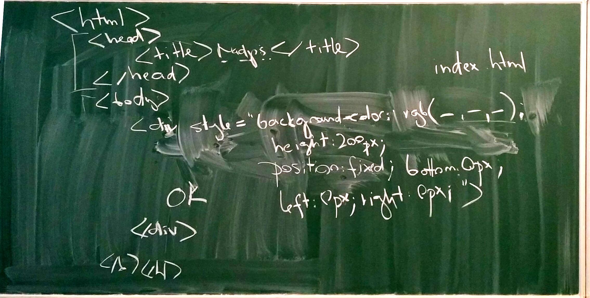
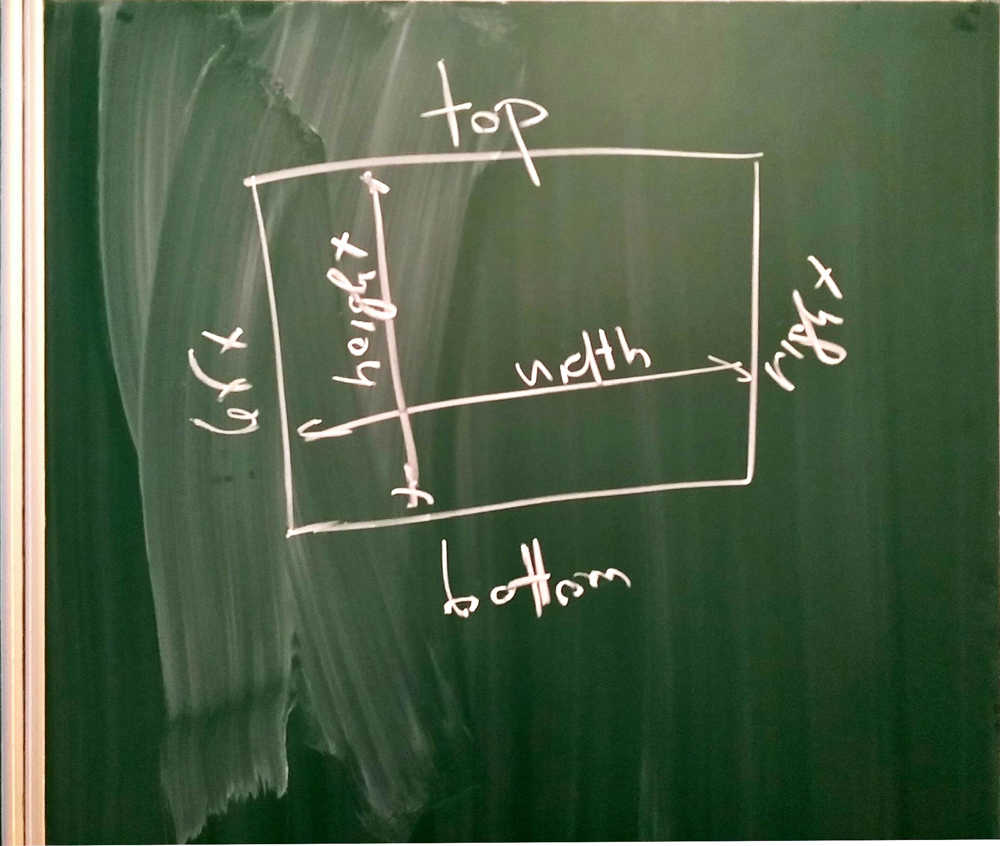

# První sezení 9. ledna 2018

## Párové programování

Programátoři dnes častro pracují ve dvojici. Nazýváme to párové programování (pair programming). Jeden programátor píše u klávesnice a druhý se kouká, radí a komentuje. Po pár minutách se u klávesnice střídají.

Je prokázáno, že párové programovaní je více produktivní, protože programátoři píšou kvalitnější kod a dělají méně chyb.

## Plán 

Budeme se učit programovat na nějaké jednodušší hře: nejprve se naučíme "malovat na obrazovku" pomocí HTML, pak použijeme JavaScript a ty malůvky rozpohybujeme a na konec přidáme nějaké ovládání a zvuky (jo, hlavně ty zvuky!).

## HTML

HTML se skládá z tzv. značek: každou značku je třeba otevřít a pak zavřít na opačné straně. Jako třeba:

```html
<html>
...
</html>
```

Zápisem `<html>` značku otevřeme, zápisem `</html>` ji uzavřeme.

Náš základní HTML dokument vypadal takto:

```html
<html>
    <head>
        <title>Muj prvni HTML dokument</title>
    </head>
    <body>
        Tu ho mame!!!
    </body>
</html>
```

Podívejte se na něj tady: [první verze](verze-1.html) 

Pak jsme text v `body` nahradili značkou `div` a té jsme přidali styl a změnili mu barvu:

```html
<div style="background-color: yellow;">Tu ho mame</div>
```

Všimněte si dvojtečky a středníku a kde opravdu končí otevírací zápis značky `div`!

Barvy můžeme vybírat z pojmenovaných barev jako je yellow nebo pomocí rgb funkce vypsat červenou, zelenou a modrou složku barvy jako čísla od 0 do 255.

Podívejte se tady: [druhá verze](verze-2.html)

Nakonec jsme div odpojili od struktury dokumentu a umístili ho libovolně do okna prohlížeče. 

Toho se docílí tak, že se poloha a velikost divu přidá do stylu. Například takto:

```html
<div style="background-color: yellow; 
        position: fixed; 
        left: 0px; right: 0px; bottom: 0px; 
        height: 150px;">
    Na spodku okna
</div>
```

K dispozici máme šest vlastností (top, bottom, right, left, height, width) a nastavit můžeme čtyři z nich. Ostatní se dopočítají z velikosti okna. Nastavit můžeme velikost v pixelech (zkratkou "px") nebo v procentech (když chceme třeba aby výška byla 10% výšky okna).

Opět věnujte pečlivou pozornost střídání dvojteček a středníků uvnitř definice stylu, včetně středníku úplně na konci.

Na finální verzi se podívejte tady: [třetí verze](verze-3.html)

## Snímky tabule



