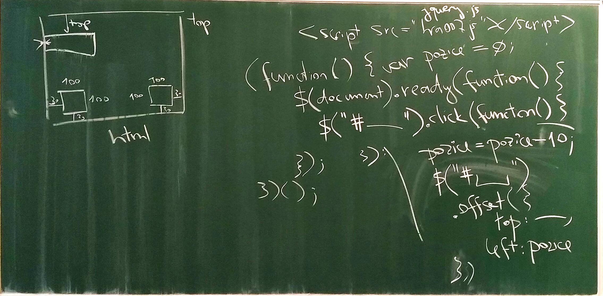

# Druhé sezení 16. ledna 2018

## Klávesové zkratky

Dneska budeme potřebovat řadu značek, které se na klávesnici dost špatně hledají. Začneme teda tím, že se ujistíme, kde tyto značky na klávesnici jsou.

Dejte si také pozor, jakou používáte klávesnici. Jsou dvě základní možnosti, které se liší tím, co máte v levém dolním rohu za písmenko: 

- je-li tam "Z", máte takzvanou "QWERTY" klávesnici (obvykle klasická anglická klávesnice), co má na horní řadě číslice
- je-li tam "Y", máte takzvanou "QWERTZ" klávesnici (obvykle česká klávesnice), co má nahoře místo čísel česká písmena s háčkama a čárkama (číslo napíšete tak, že zmáčknete klávesu Shift současně s klávesou v horní řadě).

Existuje velké množství klávesnic, například německá je taky QWERTZ jako česká, ale na horní řadě má číslice jako anglická.

Nás nejvíc ale zajímají následující značky, a ty jsou bohužel na každé klávesnici jinde, a na některých nejsou vůbec:

| značka | na anglické QWERTY | na české QWERTZ |
| --- | --- | --- |
| ; středník  | napravo od L | úplně vlevo nahoře, vedle jedničky |  
| : dvojtečka | napravo od L, se shiftem | dole vpravo, se shiftem |  
| { levá složená závorka| napravo od P, se shiftem | Alt-Gr zároveň s B |  
| } pravá složená závorka | o dv2 napravo od P, se shiftem | Alt-Gr zároveň s N |  
| ( levá kulatá závorka | 9 se shiftem | vpravo nahoře, se shiftem |  
| ) pravá kulatá závorka | 0 se shiftem | vpravo nahoře, ale bez shiftu |  
| " uvozovky (jen nahoře, nikdy dole) | o dvě napravo od L, se shiftem | ů (napravo od L) se shiftem |  
| # křížek neboli  hash | 3 se shiftem | Alt-Gr zároveň s X |  
| $ tzv. dolar | 4 se shiftem | Alt-Gr zároveň s ů (napravo od L) |  
| , čárka | napravo od M | napravo od M |  
| + plus | o dvě napravo od nuly, se shiftem | nahoře vlevo, místo 1|  
| - mínus | napravo od nuly, ale bez shiftu | vpravo úplně dole |  

Zvolte si jednu, svojí klávesnici, a trošku to trénujte!

## Programujeme scénu

Na začátku naše hra potřebuje scénu. To umíme už od minula, takže jenom rychlé opáčko. HTML dokument vypadá následovně:

```html
<html>
    <head>
        <title>Nase hra</title>
    </head>
    <body style="background-color: yellow;">
        ...sem přijde naše hra...
    </body>
</html>
```

Teď mezi značky `<body>` a `</body>` umístíme tři hrací prvky, dva jako tlačítka na ovládání do dolních rohů a jeden navrch, co časem bude představovat autíčko (nebo tak něco):

```html
<div id="vlevo" style="position:fixed;width:100px;height:100px;left:30px;bottom:30px;">L</div>
<div id="vpravo" style="position:fixed;width:100px;height:100px;right:30px;bottom:30px;">R</div>
<div id="box" style="position:fixed;width:200px;height:30px;top:200px;">...</div>
```

Každý `<div>` má svoje jméno (ID), které je unikátní (tzn. nemůžou být dva DIVy s tím samým ID) a pomocí atributu style mu nastavíme pozici. Můžete si taky nastavit pomocí background-color barvu.

Tak a máme scénu. Teď budeme konečně programovat!

## Základ programu

Budeme potřebovat dva soubory: jeden se jmenuje jquery.js a stáhněte si ho odsud: https://jquery.com/download/. Můžete stáhnout compressed nebo uncompressed verzi, pojmenujte ten soubor jednoduše jquery.js.

Druhý soubor pojmenujte třeba hra.js, zatím bude prázdný.

Teď soubory s programy a scénu propojíme. Uděláme to tak, že mezi poslední `<div>` a koncový `</body>` následující řádky:

```html
<script type="text/javascript" src="jquery.js"></script>
<script type="text/javascript" src="hra.js"></script>
```

Teď to uložte, otevřete scénu v prohlížeči a hned v dalším kroku to rozhýbáme.

## Píšeme kód

Otevřete si soubor hra.js a začněme psát program

```javascript
(function () {
    $(document).ready(function () {
        
    });
})();
```

## Snímky tabule

